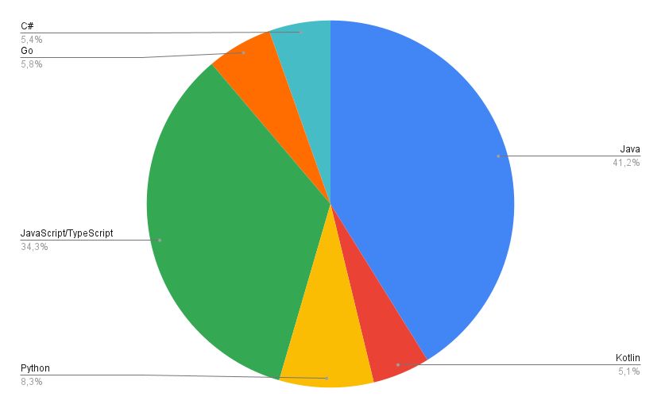

---

   **Date de rendu finale : fin février**
   - Respecter la structure pour que les chapitres soient bien indépendants
   - Remarques :
        - La structure proposée est là pour vous aider, mais peut-être adaptée à votre projet
        - Les titres peuvent être modifiés pour être en adéquation avec votre étude. 
        - Utiliser des références pour justifier votre argumentaire, vos choix, etc.
        - Vous avez le choix d'utiliser le français ou l'anglais.

    Dans l'article de Blog [Debret 2020], l'auteure donne les éléments principaux de la démarche d'une manière simple et très facile à lire, dans la partie [Quelles sont les étapes d’une bonne démarche scientifique ?](https://www.scribbr.fr/article-scientifique/demarche-scientifique/#:~:text=La%20d%C3%A9marche%20scientifique%20permet%20d,de%20nouvelles%20hypoth%C3%A8ses%20%C3%A0%20tester.)

---

---
# TODO: Supprimer ce bandeau avant le rendu

Critères d'évaluation :
- Présentation des résultats
- Analyse des résultats et commentaires
- Lien avec les hypothèses
- Si nécessaires, préciser les limites
- Recul et Pertinence des remarques
- Retour sur vos contributions
- Perspectives
- Format : Structure, forme, ...
- Contexte dont la motivation
- Question générale : Formulation, intérêt, limites éventuelles.
- Quelle est votre base d'information
- Quelles sous-questions et hypothèses
- Quelles expérimentations, démarches choisies pour vérifier ou non vos hypothèses, justifications.
- Quels outils sont utilisés ?
- Justification des choix
- Résultats
- Conclusion
---

**_février 2024_**

## Authors

Nous sommes quatre étudiants ingénieurs en dernière année à Polytech Nice Sophia, spécialisés en Architecture Logiciel :

* Thomas GUIOT &lt;thomas.guiot@etu.unice.fr&gt;
* Antony MARTIN &lt;antony.martin@etu.unice.fr&gt;
* Christophe RUIZ &lt;christophe.ruiz@etu.unice.fr&gt;
* Corentin RUIZ &lt;corentin.ruiz@etu.unice.fr&gt;
* Cyril VROUSOS &lt;cyril.vrousos@etu.unice.fr&gt;
## I. Contexte de recherche / Projet

Les architectures microservices ont récemment émergé comme une approche dans le domaine du développement logiciel, offrant une alternative décentralisée aux structures monolithiques. Cette transition vers les microservices est motivée par le désir d'accroître la modularité, la flexibilité et la scalabilité des applications. Les projets open source embrassent de plus en plus ces architectures distribuées, reconnaissant leur potentiel à répondre aux exigences croissantes de systèmes logiciels complexes.

L'un des patterns les plus populaires intégrés aux architectures microservices est l'event-sourcing. Cette pratique de conception propose un modèle où chaque modification de l'état d'une application est enregistrée sous forme d'événement immuable. L'event-sourcing offre une traçabilité granulaire des changements, facilitant la reconstitution de l'état d'une application à n'importe quel moment. Dans le contexte des microservices, cette approche peut renforcer la cohérence des données dans des environnements distribués, améliorant ainsi la résilience et la gestion des transactions.

Une intégration réussie de l'event-sourcing dans les architectures microservices nécessite une bonne compréhension des échanges entre les services. L'adoption croissante de l'event-sourcing dans des projets open source souligne l'importance de cette intégration et pose des questions cruciales sur sa pertinence et son efficacité dans ce contexte spécifique.

En analysant les caractéristiques de l'intégration de l'event-sourcing, il devient possible d'identifier la complexité d'apprentissage associée à chaque projet. Cette évaluation permettra de catégoriser les projets en fonction de leurs approches et visions spécifiques de l'event-sourcing, contribuant ainsi à définir des modèles d'implémentation et à se renseigner sur les meilleures pratiques.

Par ailleurs, l'évaluation de la pertinence de l'implémentation de l'event-sourcing dans les projets open source en microservices offre une opportunité significative d'identification de cas d'utilisation exemplaires et d'approches novatrices. Ces exemples pourraient servir de références inspirantes pour d'autres développeurs et équipes de projet, favorisant ainsi la diffusion de bonnes pratiques et contribuant à l'amélioration continue de la qualité logicielle au sein de la communauté open source.

## II. Observations/Question générale

Notre sujet est motivé par la question suivante.

> Les projets open-source implémentés en micro-services sont-ils de bons candidats pour apprendre les principes des architectures micro-services ?

### Sous-question
Nous avons choisi de restreindre ce sujet à la question suivante.

> Quelles stratégies les projets open source utilisant une architecture microservices mettent-ils en place pour intégrer et utiliser de manière efficace un bus d'événements dans leurs systèmes ?

### Pourquoi se concentrer sur la gestion des événements ?

Se pencher sur la manière dont les projets open source intègrent un système de bus d'événements dans leurs logiciels est une question importante. Lorsqu'on parle d'architectures microservices, on parle de comment organiser un système pour qu'il soit plus flexible, évoluable et facile à entretenir. Le fait d'ajouter un bus d'événements dans cette configuration facilite la communication entre les différentes parties du logiciel de manière plus souple, ce qui permet de mieux coordonner les actions.

Cette question prend tout son sens quand on parle de maintenance logicielle, car elle explore comment les projets open source s'attaquent aux problèmes liés à la gestion des événements dans des systèmes qui sont répartis sur plusieurs parties. Comprendre ces différentes façons de faire est essentiel pour s'assurer que ces systèmes restent stables, résilients et cohérents au fil du temps, tout en facilitant l'ajout de nouvelles fonctionnalités. En résumé, la question aborde des aspects très importants pour la manière dont ces projets fonctionnent au quotidien et pour leur pérennité.

### Comment allons-nous procéder ?

Pour pouvoir procéder à notre analyse, nous allons devoir tout d'abord couper notre sous-question en de plus petites questions pour permettre de cibler chaque élément de la question :

1. Comment reconnaître un projet micro-service ?
2. Comment détecter l'utilisation d'un bus ?
3. Comment identifier les micro-services dans un projet ?
4. Par quels moyens les bus sont utilisés dans le projet ?

## III. Collecte d'informations

### Articles

Pour nous aider dans cette étude, nous avons pu nous appuyer sur les articles suivants :

* Microservices Guide - Martin Fowler https://martinfowler.com/microservices/

   Les ouvrages de Martin Fowler nous ont suivis tout au long de ce semestre pour nous apprendre les rouages des systèmes distribués en microservice, nous devions nous appuyer sur ces travaux pour nous diriger sur la question que nous souhaitions traiter lors de ce chapitre

* Microservices analysis https://github.com/deib-polimi/microservices-analysis

   Nous nous sommes appuyés sur ce projet pour nous aider à comprendre comment créer notre premier jeu de données.

### Outils

Pour les outils, nous avons majoritairement créé nos propres outils/scripts en Python pour nous permettre d'analyser du code statique notamment.

### Jeu de données

Pour cette partie, nous avons cherché à créer notre propre jeu de données à l'aide de l'API GitHub ainsi que des scripts Python. 
 
## IV. Hypothèses et expériences

## Création du jeu de données

   Pour la création du jeu de données, nous avons émis une petite hypothèse que nous pouvions trouver des projets microservices grâce à des recherches dans leurs noms ainsi que dans leurs descriptions. Nous avons aussi utilisé le fichier CSV donné dans le projet Microservices analysis. 

### Comment dans ce jeu de données pouvons-nous considérer que le projet est bien un projet micro-service ?

>Hypothèse 1 : Un projet est considéré comme micro-service quand on trouve un docker-compose dans le projet qui n'est pas vide et qui contient au moins deux clés. 

> Description :
 Dans cette expérience, nous souhaitons réduire notre jeu de données initialement trouvé grâce à la recherche des mots-clés sur l'API GitHub. 
 
 #### Démarche :

 * Pour ce faire, nous devons créer un script permettant d'accéder à chaque repo de notre premier jeu de données, chercher dans ce dernier l'existence d'un docker-compose. 

* Une fois le docker-compose trouvé, nous devons analyser le docker-compose pour y trouver le nombre de services potentiels (les clés YAML) mais aussi l'utilisation ou non d'un bus

### Limites & Décision :

Il y a plusieurs limites à cette approche :

1. Tout d'abord, il est assez facile de trouver docker-compose dans un repo avec le mot-clé microservices. 
2. Ensuite, rien ne garantit que l'utilisation du docker-compose n'est pas uniquement pour des bases de données ou autres technologies
3. Pour finir, l'étude peut vite devenir compliquée s'il on accepte les différentes technologies et langages possibles

Pour remédier à certaines de ces limites, nous avons dû faire le choix de nous restreindre à un langage et une technologie de bus d'événements.

Pour ce faire, nous avons choisi de nous restreindre à Kafka pour le bus d'événements car la technologie était présente dans la majorité des projets choisis et nous étions familiers avec la technologie.

Cependant, nous devions faire un choix sur quel langage cibler. Pour cela, nous avons créé un script permettant de sortir les statistiques des langages les plus utilisés de notre jeu de données.

Ce graphique nous a permis d'identifier que la majorité des projets de notre dataset étaient des projets développés en Java. Notre choix s'est donc porté vers ce langage.

## Détection d'un bus

>Hypothèse 2 : Un projet utilise un bus Kafka quand on trouve dans le docker-compose une trace d'un nom contenant le mot Kafka, par exemple: kafka, broker-kafka, etc..

> Description: Dans cette expérience, nous souhaitons garantir l'utilisation du broker Kafka de chaque projet de notre dataset.

#### Démarche :

* Création et exécution d'un script Python permettant de parcourir un repo GitHub donné en paramètre 
* Analyse du docker-compose pour retrouver les mots-clés contenant Kafka

## Comment identifier les micro-services dans un projet ?

> Hypothèse 3 : Tous les micro-services se retrouvent dans le docker-compose étant donné que le projet en microservices s'exécute dans un environnement Docker

> Description: Nous souhaitons avec cette expérience pouvoir identifier chaque microservice d'un projet pour nous permettre ensuite l'identification des communications entre les services

#### Démarche : 

* Création et exécution d'un script Python permettant de parcourir un repo GitHub donné en paramètre 
* Analyse du docker-compose pour créer un tableau de chaque clé YAML.

### Limites & Décision

Les limites que nous avons pu rencontrer dans cette partie sont la manière dont un docker-compose est utilisé. Le docker-compose ne sert pas uniquement à l'exécution des microservices mais à l'exécution d'un tas d'autres outils comme les bases de données, le monitoring, les brokers, etc...

    zipkin: <=== un zipkin
    
    image: openzipkin/zipkin
    
    ports:
    
    - "9411:9411"
    
    mongo: <== une base de données
    
    image: mongo
    
    ...
    
    order-service:  <== potentiel service
    
    image: order-service
    
    api-gateway: <==== une gateway
    
    image: api-gateway
    
    ...

Pour ce faire, nous avons dû créer une liste de mots-clés rencontrés régulièrement dans tous nos projets pour retirer toutes les technologies qui ne seraient pas des microservices

## Par quels moyens les bus sont-ils utilisés dans le projet ?

> Hypothèse 4.1 : Les bus kafka utilise essentiellement des consommateur et des producteurs, nous faisons l'hypothése après analyse des differrents projets qu'il n'y a qu'une seul manière de faire pour produire et consommer en Java. 
La manière de produire un événement est l'utilisation de la méthode `.send()` et la consommation de cette événement ce fait par l'annotation `@KafkaListener`.

> Description : Dans cette experience nous souhaitons retrouver les producteurs et les consommateurs grâce à de l'analyse statique de code.

#### Démarche : 

* Création et exécution d'un script Python permettant de cloné un repo GitHub donné en paramètre 
* Analyse de tous les fichiers du repo finissant par .java
* Identifier les mot clès `.send()` et `@KafkaListener`
* Une fois mot-clès identifier, trouvé le services utiliser grâce au chemin absolus
* Enregistre les informations sur le fichier (producteur/consommateur) et le service dans un fichier au format JSON

### Limites : 

   - Nous nous arretons à qu'un seul types de production et consommation s'il existe une autre maniere de faire alors celle ci ne sera pas detecté.
   
   - Si la maniere de faire évolue au cours des mise à jours la détection devients obsolètes

> Hypothèse 4.2 : Les bus kafka établisse leurs communication entre producteurs et consommateur grâce à des topics, selon notre analyse et donc hypothèse il existe seulement 3 moyens de déclarer ces topics (statiquement dans le code, dans le docker-compose, dans les properties).

> Description : Cette éxperience à pour but d'identifier tous les topics pour le bus kafka permettant la communication entre les microservices.

#### Démarche : 

* Création et exécution d'un script Python permettant de cloné un repo GitHub donné en paramètre 
* Analyse de tous les fichiers du repo finissant par .java pour l'analyse des topics statique dans le code
* Analyse du ou des docker-compose du repo
* Analyse des diferrents fichiers .properties pour retrouver le mots clès 
`kafka.topic`
* Créer un fichier JSON rensemblant l'union de toute les analyse précédente

### Limites : 

  - Il est parfois difficile de retoruver statiquement les topics dans le code
  - Il est aussi compliqué d'identifier les communications entre quelle producteur et quelle consommateur communique car quand il est assez facile de trouver le topic pour les consommateur c'est souvent le contraire pour les producteurs

  `@KafkaListener("Topic-Name")` <== topic très souvent écrit en dur dans le code pour les consommateur

  `producer.send(topicVar)` <== nom du topic très souvent utilisé dans une variable

## V. Analyse des résultats et conclusion

1. Présentation des résultats
2. Interprétation/Analyse des résultats en fonction de vos hypothèses
3. Construction d'une conclusion 

     :bulb:  Vos résultats et donc votre analyse sont nécessairement limités. Précisez bien ces limites : par exemple, jeux de données insuffisants, analyse réduite à quelques critères, dépendance aux projets analysés, ...
4. On peut dire que certaines métriques ne sont pas forcément intéressantes

## VI. Outils \(facultatif\)

1. **analyze-data-set-statistic:**
   - Ce dossier contient des scripts de statistiques spécifiques pour les jeux de données comme les statistique sur les langages. 

2. **analyzer-data-set:**
   - Ce dossier est le plus crucial, abritant le script principal permettant d'analyser un projet. Il génère et affiche les métriques importantes associées au projet, offrant une vue d'ensemble des performances.

3. **search-consumers:**
   - Ce dossier contient un script permettant de rechercher les consommateurs dans un environnement Kafka. Il facilite l'identification des composants qui consomment des données à partir d'un sujet particulier.

4. **search-producers:**
   - Ce dossier abrite un script destiné à la recherche des producteurs dans un système Kafka. Il simplifie la localisation des composants responsables de la production de données vers un sujet spécifique.

5. **search-data-set-script:**
   - Ce dossier héberge un script essentiel permettant de créer le premier ensemble de données en utilisant l'API GitHub. Il facilite la collecte initiale de données à partir du référentiel pour l'analyse ultérieure.

6. **search-microservices:**
   - Ce dossier contient un script qui aide à identifier les microservices d'un projet. Il offre une vue détaillée de l'architecture en identifiant les composants qui fonctionnent de manière indépendante.

7. **search-topic:**
   - Ce dossier abrite un script facilitant la recherche de sujets dans un environnement Kafka. Il permet d'explorer et d'analyser les différents sujets utilisés dans le système.

## VI. Références

[Debret 2020] Debret, J. (2020) La démarche scientifique : tout ce que vous devez savoir ! Available at: https://www.scribbr.fr/article-scientifique/demarche-scientifique/ (Accessed: 18 November 2022).
